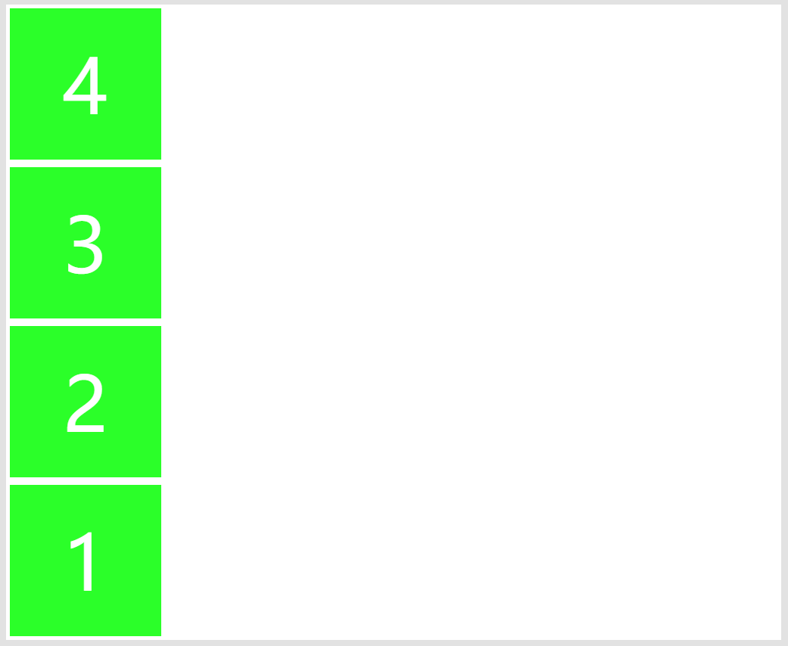
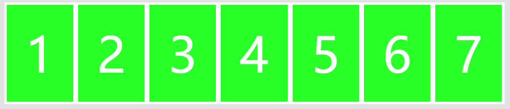
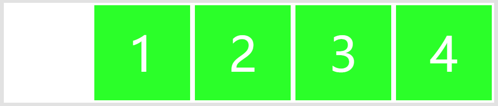

# 默认的CSS元素样式
```css
body {
      padding: 20px;
      margin: 0 auto;
      background-color: #E2E2E2;
      max-width: 1024px;
      color: #595B66;
      font-family: 'Microsoft Yahei', sans-serif;
}

.box {
    background-color: white;
    margin: 0 0 55px;
    display: flex;
}

.box-item {
    width: 200px;
    height: 200px;
    line-height: 200px;
    vertical-align: middle;
    margin: 5px;
    background-color: #2bff29;
    font-size: 100px;
    color: white;
    text-align: center;
}
```

# 1. [flex-direction](./01-Flex布局/01-flex-direction.html)
+ `flex-direction`决定主轴的方向，就是项目的排列方向
+ `row`元素横向排列
+ `row-reverse`元素横向反向排列
+ `column`元素纵向排列
+ `column-reverse`元素纵向反向排列

### 1.0 统一的DOM元素
```html
<div class="box">
    <div class="box-item">1</div>
    <div class="box-item">2</div>
    <div class="box-item">3</div>
    <div class="box-item">4</div>
</div>
```

### 1.1 `flex-direction: row;`
+ 元素横向正序排列
```css
.box { 
    flex-direction: row; 
}
```


### 1.2 `flex-direction: row-reverse;`
+ 元素横向反序排列


```css
.box { 
    flex-direction: row-reverse; 
}
```

### 1.3 `flex-direction: column;`
+ 元素纵向正序排列


```css
.box { 
    flex-direction: column; 
}
```

### 1.4 `flex-direction: column-reverse;`
+ 元素纵向反序排列


```css
.box { 
    flex-direction: column-reverse; 
}
```

# 2. [flex-wrap](./01-Flex布局/02-flex-wrap.html)
+ `flex-wrap`定义的是，如果元素在一行里排不下，如何换行
+ `nowrap`不换行
+ `wrap`换行，第一行在上边
+ `wrap-reverse`换行，第一行在下边

### 2.0 统一的DOM元素
```html
<div class="box">
    <div class="box-item">1</div>
    <div class="box-item">2</div>
    <div class="box-item">3</div>
    <div class="box-item">4</div>
    <div class="box-item">5</div>
    <div class="box-item">6</div>
    <div class="box-item">7</div>
</div>
```
### 2.1 `flex-wrap: nowrap;`
+ 不换行


```css
.box { 
    flex-direction: row;
    flex-wrap: nowrap;
}
```

### 2.2 `flex-wrap: wrap;`
+ 换行


```css
.box { 
    flex-direction: row;
    flex-wrap: wrap;
}
```

### 2.3 `flex-wrap: wrap-reverse;`
+ 换行，第一行在下边


```css
.box { 
    flex-direction: row;
    flex-wrap: wrap-reverse;
}
```

# 3. [flex-flow](./01-Flex布局/03-flex-flow.html)
+ `flex-flow`是`flex-direction`和`flex-wrap`的简写形式，第一个值是`flex-direction`,第二个值是`flex-wrap`
+ 默认值是`row`和`nowrap`

```css
.box {
    flex-flow: row nowrap;
}
```

# 4. [justify-content](./01-Flex布局/03-justify-content.html)
+ `justify-content`定义的是元素在主轴的对齐方式
+ `flex-start`左对齐，默认值
+ `flex-end`右对齐
+ `center`居中
+ `space-between`两端对齐，元素之间的间隔都相等
+ `space-around`每个元素两侧的间隔相等。所以元素黄子健的间隔比元素与边框的间隔大一倍

### 4.0 统一的DOM元素
```html
<div class="box">
    <div class="box-item">1</div>
    <div class="box-item">2</div>
    <div class="box-item">3</div>
    <div class="box-item">4</div>
</div>
```

### 4.1 `justify-content: flex-start;`
+ 左对齐


```css
.box {
    justify-content: flex-start;
}
```

### 4.2 `justify-content: flex-end;`
+ 右对齐


```css
.box {
    justify-content: flex-end;
}
```

### 4.3 `justify-content: center;`
+ 居中


```css
.box {
    justify-content: center;
}
```

### 4.4 `justify-content: space-between;`
+ 两端对齐，元素之间的间隔都相等


```css
.box {
    justify-content: space-between;
}
```

### 4.5 `justify-content: space-around;`
+ 每个元素两侧的间隔相等


```css
.box {
    justify-content: space-around;
}
```