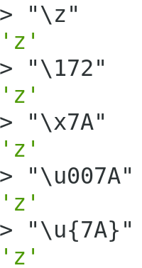

## 字符串的扩展
## 1. 字符的`Unicode`表示法
+ JavaScript允许采用`\uxxxx`形式表示一个字符,其中`xxxx`表示字符的`Unicode`码点
```javascript
console.log("\u0061");
// 'a'
```
+ 这种表示法只限于码点在`\u0000`~`\uFFFF`之间的字符.超出这个范围的字符,必须用两个双字节的形式表示.
```javascript
console.log("\uD842\uDFB7");
// '𠮷' 
// node中,Linux显示'𠮷',Windows显示为'�'
```
+ 上面代码表示,如果直接在`\u`后面跟上超过`0xFFFF`的数值,比如`\u20BB7`,JavaScript会理解成`\u20BB+7`.由于`\u20BB`是一个不可打印字符,所以只会显示一个空格,后面跟着一个`7`
```javascript
console.log("\u20BB");
// '₻' 
console.log("\u20BB7");
// '₻7'
```
+ ES6中，只要将码点放入大括号,就能正确解读该字符
大括号表示法与四字节的`UTF-16`编码是等价的
```javascript
console.log("\u{20BB7}");
// '𠮷'
console.log("\u{41}\u{42}\u{43}");
// 'ABC'
console.log('\u{1F680}' === '\uD83D\uDE80');
// true
```
+ JavaScript共有5种方法可以表示一个字符
5种方法可以表示小写字母`Z`


## 2. `codePointAt()`
+ JavaScript内部,字符以`UTF-16`的格式储存,每个字符固定为`2`个字节.
+ 对于那些需要`4`个字节储存的字符(`Unicode`码点大于`0xFFFF`的字符),JavaScript会认为它们是两个字符.
```javascript
let m = '𠮷';
console.log('m.length:', m.length); // m.length: 2
console.log('m.charAt(0):', m.charAt(0));// m.charAt(0): �
console.log('m.charAt(1):', m.charAt(1));// m.charAt(1): �
console.log('m.charCodeAt(0):', m.charCodeAt(0));// m.charCodeAt(0): 55362
console.log('m.charCodeAt(1):', m.charCodeAt(1));// m.charCodeAt(1): 57271
```
> 上面代码中,汉字`𠮷`(注意,这个字不是'吉祥'的`吉`)的码点是`0x20BB7`,`UTF-16`编码为`0xD842` `0xDFB7`(十进制为`55362`,`57271`),需要`4`个字节储存.
> 对于这种`4`个字节的字符,JavaScript 不能正确处理,字符串长度会误判为`2`,而且`charAt`方法无法读取整个字符,`charCodeAt`方法只能分别返回前两个字节和后两个字节的值.

+ ES6提供了`codePointAt`方法,能够正确处理`4`个字节储存的字符,返回一个字符的码点.
```javascript
let m = '𠮷a';
console.log(m.codePointAt(0));
// m.codePointAt(0): 13407
console.log(m.codePointAt(1));
// m.codePointAt(1): 57271
console.log(m.codePointAt(2));
// m.codePointAt(1): 97
console.log(m.codePointAt(0).toString(16));
// m.codePointAt(0).toString(16): 20bb7
console.log(m.codePointAt(1).toString(16));
// m.codePointAt(1).toString(16): dfb7
console.log(m.codePointAt(2).toString(16));
// m.codePointAt(1).toString(16): 61
```
### 2.1 `codePointAt`方法的参数
+ 在字符串中的位置(从`0`开始).上面代码中,JavaScript将`𠮷a`视为三个字符,`codePointAt` 方法在第一个字符上,正确地识别了`𠮷`,返回了它的十进制码点 `134071`(即十六进制的`20BB7`).在第二个字符(即`𠮷`的后两个字节)和第三个字符`a`上,`codePointAt方`法的结果与`charCodeAt`方法相同.

+ 总之,`codePointAt`方法会正确返回`32`位的`UTF-16`字符的码点.对于那些两个字节储存的常规字符,它的返回结果与`charCodeAt`方法相同.

+ 在上面的`𠮷a`字符串中,`a`是第二个字符,但是使用`codePointAt()`的参数却是`2`,所以解决这个问题的方法是使用`for...of`循环,因为它可以正确识别`32`位的`UTF16`字符.
```javascript
let m = '𠮷a';
for(let key of m) {
    console.log(`key.codePointAt(${key}).toString(16):key.codePointAt(${key}).toString(16);`);
}
/**
* key.codePointAt(𠮷).toString(16):key.codePointAt(𠮷).toString(16);
* key.codePointAt(a).toString(16):key.codePointAt(a).toString(16);
* */
```
### 2.2 测试一个字符由两个字节还是由四个字节组成的
```javascript
function is32Bit(str) {
    return str.codePointAt(0) > 0xFFFF;
}
console.log(is32Bit('𠮷')); // is32Bit('𠮷'): true
console.log(is32Bit('a'));  // is32Bit('a'): false
```

## 3. `String.fromCodePoint()`
+ ES5提供`String.fromCharCode`方法,用于从码点返回对应字符,但是这个方法不能识别`32`位的`UTF-16` 字符(Unicode 编号大于`0xFFFF`).
+ `String.fromCharCode`不能识别大于`0xFFFF`的码点,所以`0x20BB7`就发生了溢出,最高位`2`被舍弃,最后返回码点`u+0BB7`对应的字符,而不是码点`U+20BB7`对应的字符
```javascript
console.log(String.fromCharCode(0x20bb7));// String.fromCharCode(0x20bb7): ஷ
console.log(String.fromCharCode(0x0bb7));// String.fromCharCode(0x0bb7): ஷ
console.log(String.fromCharCode(0xbb7));// String.fromCharCode(0xbb7): ஷ
console.log(String.fromCharCode(0xb7));// String.fromCharCode(0xb7): ·
console.log(String.fromCharCode(0x7));// String.fromCharCode(0x7):
```
+ ES6提供了`String.fromCodePoint`方法,可以识别大于`0xFFFF`的字符,弥补了`String.fromCharCode`方法的不足.在作用上,正好与`codePointAt`方法相反
```javascript
console.log(String.fromCodePoint(0x20BB7));
// 𠮷

console.log(String.fromCodePoint(0x78, 0x1f680, 0x79) === 'x\uD83D\uDE80y');
// true
```
> 如果`String.fromCodePoint`方法有多个参数,则它们会被合并成一个字符串返回
> 注意: `fromCodePoint`方法定义在`String`对象上,而`codePointAt`方法定义在字符串的实例上

## 4. 字符串的遍历器接口
```javascript
for (let code of 'STRING_OBJECT') {
    console.log('code:', code);
}
/****
 * code: S
 * code: T
 * code: R
 * code: I
 * code: N
 * code: G
 * code: _
 * code: O
 * code: B
 * code: J
 * code: E
 * code: C
 * code: T
 */
```
+ `for...of`遍历器最大的优点是可以识别大于`0xFFFF`的码点,传统的`for`循环无法识别这样的码点
```javascript
let m = String.fromCodePoint(0x20BB7);
for(let i = 0; i < m.length;i++) {
    console.log(i);
    // 0
    // 1
}
for(let j of m){
    console.log(j);// 𠮷
}
```
## 5. `at()`[垫片库](https://github.com/es-shims/String.prototype.at)
+ ES5对字符串对象提供`charAt`方法,返回字符串给定位置的字符.该方法不能识别码点大于`0xFFFF`的字符.
```javascript
let one = 'abc';
let two = '𠮷';
console.log('one.charAt(0):', one.charAt(0));// one.charAt(0): a
console.log('two.charAt(0):', two.charAt(0));// two.charAt(0): 𠮷
```
+ `charAt`方法返回的是`UTF-16`编码的第一个字节,实际上是无法显示的.
```javascript
require('./at');
let one = 'abc';
let two = '𠮷';
console.log('one.at(0):', one.at(0));// one.at(0): a
console.log('two.at(0):', two.at(0));// two.at(0): 𠮷
```

## 6. `includes()`,`startsWith()`,`endsWith()`
+ ES5中,JavaScript只有`indexOf`方法,可以用来确定一个字符串是否包含在另一个字符串中
+ **ES6增加了三种新方法**
+ `includes()`:返回布尔值,表示是否找到了参数字符串.
+ `startsWith()`:返回布尔值,表示参数字符串是否在原字符串的头部.
+ `endsWith()`:返回布尔值,表示参数字符串是否在原字符串的尾部.
```javascript
let str = 'Linux and Windows';
console.log(str.startsWith('Linux')); // true
console.log(str.endsWith('Windows')); // true
console.log(str.includes('and')); // true
// 第二个参数,表示开始搜索的位置.
console.log(str.startsWith('Windows', 10)); // true
console.log(str.endsWith('Linux', 5)); // true
console.log(str.includes('and', 6)); // true
```
## 7. `repeat()`
+ `repeat`方法返回一个新字符串,表示将原字符串重复`n`次.
```javascript
let str = 'water';
console.log(str.repeat(2)); // waterwater
// 参数如果是小数,则会被向下取整
console.log(str.repeat(2.9)); // waterwater
// 参数如果是负数或者是`Infinity`,则会报错
console.log(str.repeat(-1)); // 报错
console.log(str.repeat(Infinity)); // 报错
// 参数如果是0到-1之间的小数,则取整为-0,repeat将-0视同为0
console.log(str.repeat(-0.8)); // ''
// 参数NaN等同于0
console.log(str.repeat(NaN)); // ''
// 如果参数是字符串,则会先转换为数字
console.log(str.repeat('ww')); // ''
console.log(str.repeat('2')); // waterwater
```

## 8. `padStart()`,`padEnd()`
+ **node v8.2.1开始支持**
+ ES2017引入了字符串补全长度的功能.如果某个字符串不够指定长度,会在头部或尾部补全.
+ `padStart()`用于头部补全,`padEnd()`用于尾部补全
```javascript
console.log('water'.padStart(11, 'hello '));// hello water
console.log('water'.padStart(15, 'hello '));// hello hellwater
console.log('water'.padStart(8, 'hello '));// helwater
```
+ 如果用来补全的字符串与原字符串,两者的长度之和超过了指定的最小长度,则会截去超出位数的补全字符串.
```
console.log('water'.padStart(10, 'hello sherry'));// hellowater
```
+ 如果省略第二个参数,默认使用空格补全长度.
```javascript
console.log('water'.padStart(10));// '     water'
```
+ `padStart`的常见用途是为数值补全指定位数.下面代码生成`10`位的数值字符串.
```javascript
console.log('11111'.padStart(10, '0')); // 0000011111
```
+ 提示字符串格式
```javascript
console.log('09-12'.padStart(10, 'YYYY-MM-DD'));// YYYY-09-12
```
## 9. 模板字符串
+ 模板字符串(template string)是增强版的字符串,用反引号`标识.它可以当作普通字符串使用,也可以用来定义多行字符串,或者在字符串中嵌入变量.
+ 如果在模板字符串中需要使用反引号,则前面要用反斜杠转义.
```javascript
$('#list').html(`
<ul>
  <li>first</li>
  <li>second</li>
</ul>
`);
```
+ 模板字符串中嵌入变量,需要将变量名写在`${}`之中.
```javascript
function template(ken){
    if(!ken){
        throw new Error(
            // 传统写法：
            // ken  + ' is must argument'
            `ken ${ken} is must argument`
        )
    }
}
console.log(`${template()} is a template function...`);
```
+ 大括号内部可以放入任意的JavaScript表达式,可以进行运算,以及引用对象属性,调用函数等
+ 大括号中是一个对象,将默认调用对象的`toString`方法
+ 如果模板字符串中的变量没有声明,将报错
```javascript
console.log(`template string ${template}`); // ReferenceError: template is not defined
```
## 10. 标签模板
+ 模板字符串可以紧跟在一个函数名后面,该函数将被调用来处理这个模板字符串.这被称为`标签模板功能(tagged template)`
```javascript
console.log`one`; // [ 'one' ]
console.log`one two three`; // [ 'one two three' ]
```
+ 标签模板其实不是模板,而是函数调用的一种特殊形式.`标签`指的就是函数,紧跟在后面的模板字符串就是它的参数
```javascript
let one = 10;
let two = 20;

function fn(tem, ken, gen, sen) {
    console.log('tem[0]:', tem[0]);//tem[0]:  CALCken
    console.log('tem[1]:', tem[1]);//tem[1]:  CALCgen
    console.log('tem[2]:', tem[2]);//tem[2]:  CALCsen
    console.log('ken:', ken);// ken: 30
    console.log('gen:', gen);// gen: 200
    console.log('sen:', sen);// sen: 10
    return 'Finished';
}

fn` CALCken ${one + two } CALCgen ${one * two} CALCsen ${two - one}`;
```
+ `标签模板`的一个重要应用,就是过滤`HTML`字符串,防止用户输入恶意内容.
```javascript
function SaferHTML(data) {
    let sen = data[0];
    console.log(arguments); // { '0': [ '', '' ], '1': '<script>alert(12345)</script>' }
    for (let i = 1; i < arguments.length; i++) {
        console.log('arguments.length:', arguments.length); // 2
        let arg = String(arguments[i]);
        sen += arg.replace(/&/g, '&amp').replace(/</g, '&lt').replace(/>/g, '&gt');
        sen += data[i];
    }
    return sen;
}

let userInfo = '<script>alert(12345)</script>';
let innerMessage = SaferHTML`${userInfo}`;
console.log(innerMessage);// &ltscript&gtalert(12345)&lt/script&gt
```