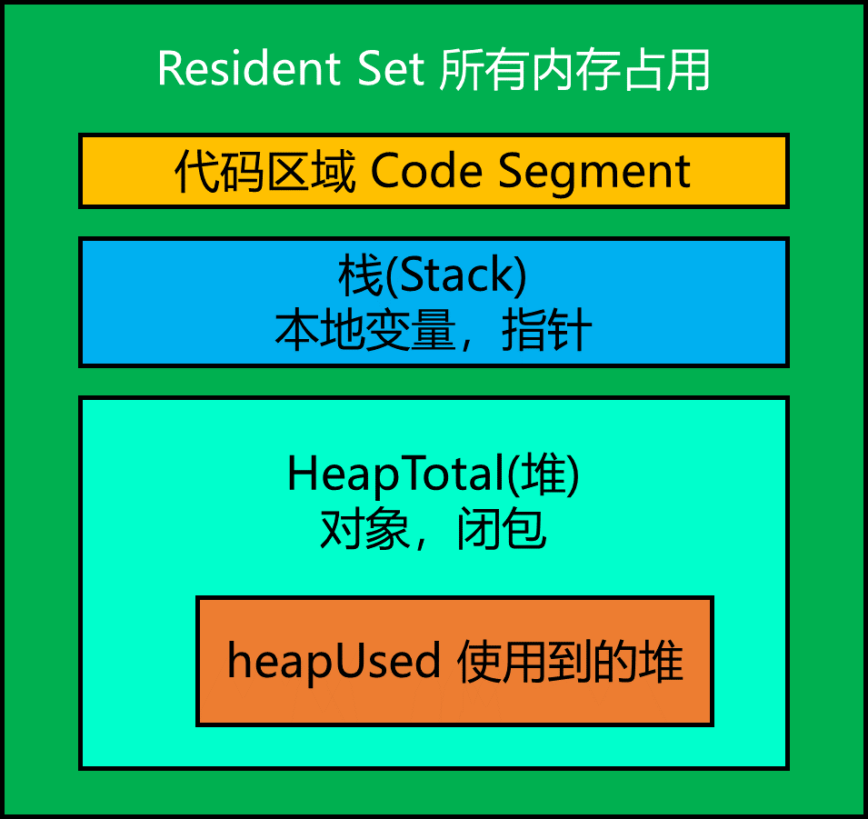

# 1. JavaScript 中的垃圾收集
+ 程序的运行需要内存，只要程序需要，操作系统就必须提供内存
+ JavaScript 使用自动内存管理，被称为垃圾回收机制
+ 优点是可以简化开发，节省代码
+ 缺点是无法完整的掌握内存的分配与回收的具体过程

# 2. Node.js 中的内存管理
+ 网页端的内存泄露
+ 对于持续运行的服务进程Node 服务器端程序，必须及时释放不再用到的内存。否则，内存占用越来越高，轻则影响系统内存，重则导致进程崩溃
+ 如果不再用到的内存没有及时释放，就叫做内存泄露。

# 3. V8 内存管理
## 3.1 V8 内存限制
+ 在 64 位操作系统中可以使用 1.4G 内存
+ 在 32 位操作系统中可以使用 0.7G 内存

## 3.2 V8 内存管理
+ JS 对象都是通过 V8 进行分配管理内存的
+ `process.memeoryUsage()` 返回一个对象，包含了 Node 进程的内存占用信息

+ rss(resident set size) 所有内存占用，包括指令区和堆栈
+ heapTotal，堆占用的内存，包括用到和没有用到的
+ heapUsed，用到的堆的部分，判断内存泄露，以 heapUsed 字段为准
+ external，V8引擎内部的 C++ 对象占用的内存

```javascript
console.log(process.memoryUsage());
let arr = [1, 2, 3, 4, 5];
console.log(process.memoryUsage());
// { rss: 19,496,960, heapTotal: 6,537,216, heapUsed: 3,840,176, external: 8,272 }
// { rss: 19,881,984, heapTotal: 7,061,504, heapUsed: 4,180,104, external: 8,272 }
// { rss: 19,906,560, heapTotal: 7,061,504, heapUsed: 4,191,864, external: 8,272 }
```
## 3.3 为什么限制内存大小
+ 因为 V8 的垃圾收集工作原理导致，1.4G 内存完全一次垃圾收集需要 1 秒以上
+ 这个暂停的时间成为 `Stop The World`，在这个期间，应用的性能和响应能力都会下降

## 3.4 如何打开内存限制
+ 一旦初始化成功，生效后不能修改
+ `-max-new-space-size`，最大 `new space` 大小，执行 `scavenge` 回收，默认 16M，单位 KB
+ `-max-old-space-size`，最大 `old space` 大小，执行 `MarkSweep` 回收，默认 1G，单位是 MB

# 4. V8 的垃圾回收机制
+ V8 是基于分代的垃圾回收
+ 不同的垃圾回收机制也不一样
+ 按照存活时间分为新生代和老生代

## 4.1 分代
+ 年龄小的是新生代，由 From 区域 和 TO 区域两个区域组成
	+ 在 64 位操作系统里，新生代内存是 32 M，FROM 区域和 TO 区域各占用 16M
	+ 在 32 位操作系统里，新生代内存是 16 M，FROM 区域和 TO 区域各占用 8M
+ 年龄大的是老生代
	+ 64 位操作系统下老生代内存是 1400M
	+ 32 位操作系统下老生代内存是 700M


## 4.2 新生代垃圾回收
+ 新生代区域一分为二，每个 16 M，一个使用，一个空闲
+ 开始垃圾回收的时候，会检查 FROM 区域的存活对象，把存活对象拷贝到 TO 区域，完成后释放空间
+ 完成后 FROM 和 TO 区域互换
+ 新生代扫描的时候是一种广度优先的扫描策略
+ 新生代的空闲小，存活对象少
+ 当一个对象经历过多次的垃圾回收依然存活的时候，生存周期比较长的对象会被移动到老生代，这个移动过程被称为晋升或升级
	+ 经过 5 次以上的回收还存在
	+ TO 的空间使用占比超过 25%，或者超大对象

## 4.3 老生代
+ mark-sweep 标记清除
+ mark-compact 标记清理
+ 老生代空间大，大部分都是活着的对象，GC 耗时比较长
+ 在 GC 期间无法响应， STOP-THE-WORLD
+ V8 有一个优化方案，增量处理，把一个大暂停换成多个小的暂停 INCREMENT-GC


